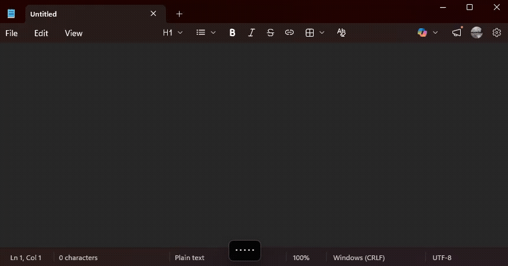

# OpenWhisper

**A local-first, privacy-respecting dictation assistant.**  
Hold a hotkey, speak, release — your text lands in whatever app you were using.

[](LICENSE)
[](https://www.python.org/downloads/)

🌐 **[Website](https://fsouza-dot.github.io/OpenWhisper/)** · 📦 **[Download](https://github.com/fsouza-dot/OpenWhisper/releases)**

---

<p align="center">
  
</p>

---

## Features

- **Push-to-talk** — Alt+Space by default, works globally
- **Fast transcription** — local Whisper or Groq cloud
- **Multilingual** — supports 90+ languages
- **Privacy-first** — audio in RAM only, keys in credential manager, no telemetry

## Install

**Requirements:** Windows 10/11, Python 3.11+

```powershell
git clone https://github.com/fsouza-dot/OpenWhisper.git
cd OpenWhisper
python -m venv .venv
.\.venv\Scripts\Activate.ps1
pip install -r requirements.txt
python run.py
```

Prebuilt binaries available in [Releases](../../releases).

### Windows Security Warnings

Since OpenWhisper is not yet code-signed, Windows may show security warnings. Here's how to run it:

**For ZIP downloads:**
1. Right-click the downloaded ZIP file → **Properties**
2. Check **"Unblock"** at the bottom → Click **OK**
3. Extract the ZIP and run `OpenWhisper.exe`

**If you see "Windows protected your PC" (SmartScreen):**
1. Click **"More info"**
2. Click **"Run anyway"**

**If you get a "Missing DLL" or "numpy C-extensions" error:**
1. Install [Microsoft Visual C++ Redistributable (x64)](https://aka.ms/vs/17/release/vc_redist.x64.exe)
2. Restart OpenWhisper

## Usage

1. Launch — look for the tray icon
2. (Optional) Add a [Groq API key](https://console.groq.com) in Settings for faster transcription
3. Press **Alt+Space**, speak, release

See [USAGE.md](USAGE.md) for details.

## Configuration

| Item | Location |
|------|----------|
| Settings | `%APPDATA%\OpenWhisper\settings.json` |
| Logs | `%APPDATA%\OpenWhisper\openwhisper.log` |
| API keys | Windows Credential Manager |

## Building

```powershell
.\.venv\Scripts\python.exe -m PyInstaller --noconfirm OpenWhisper.spec
```

See [BUILDING.md](BUILDING.md) for details.

## License

MIT — see [LICENSE](LICENSE).
